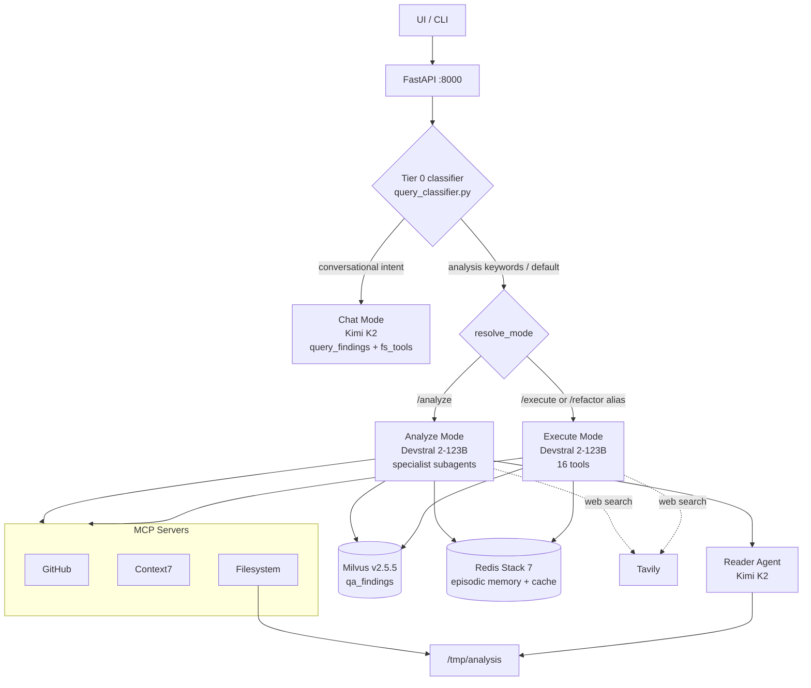
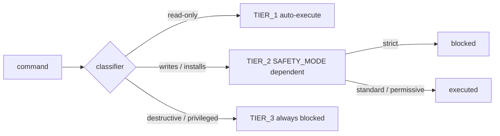

# CGN-Agent


Single-agent code intelligence system for Cognitive LATAM LLC, developed by CGN Labs.

## What's New in v2

Release documentation:

- Full v2 release notes: [`docs/WHATS_NEW_v2.md`](docs/WHATS_NEW_v2.md)
- Changelog: [`docs/CHANGELOG.md`](docs/CHANGELOG.md)

Current v2 focus areas:

- Unified mode runtime (`analyze` / `execute` / `chat`)
- Full `ui-cognitive` refactor (chat layout, activity timeline, workspace panel)
- Dynamic model selection from available NIM catalog in runtime/UI
- MCP bridge + streamable transport support
- Cron scheduler + automated markdown reporting
- Prompt-layering and memory-flow hardening
- Deterministic fallback + loop-recovery hardening in execute flows

## Features

- **Single-agent, multi-mode architecture**: one primary coder agent with three runtime modes (`/analyze`, `/execute`, `chat`). `/refactor` is supported as a compatibility alias and routes to `/execute`.
- **NVIDIA NIM**: Devstral 2-123B for analyze/execute workflows; Kimi K2 for conversational chat and summarization paths
- **Dynamic LLM selection**: runtime/UI can select among available NVIDIA NIM models via model registry and inference preferences
- **Runtime skill activation**: 9 prompt skills matched by intent triggers and filtered by tool availability (up to 2 active per request in execute mode)
- **Three-layer memory**: working memory with eviction summarization, cross-session episodic memory in Redis, auto-retrieval at session start
- **Security-first**: SAST, secret detection, CVE scanning, and deterministic shell safety tiers
- **MCP integrations**: filesystem (read/write), GitHub, and Context7 as first-class tool providers
- **Streaming with fallback**: token-by-token streaming via `astream`, automatic `ainvoke` fallback on failure
- **Vector memory**: historical findings stored in Milvus and retrieved per repo via semantic search
- **Dual workspace model**: `/tmp/analysis` for ephemeral sandbox execution, `/app/workspace` for persistent artifacts
- **Built-in observability**: full trace capture via NAT file exporter + per-user metrics endpoint

## Technology Stack

### Backend (Agent Runtime)

| Technology | Version | Purpose |
| ---------- | ------- | ------- |
| Python | 3.11+ | Main runtime for the agent backend |
| NVIDIA NAT | 1.4.1 | Agent framework, workflow orchestration, and tool calling |
| NVIDIA NAT LangChain / MCP / Redis | 1.4.1 | Integrations for model runtime, MCP servers, and caching |
| FastAPI | Via NAT | HTTP API server exposed at `:8000` |
| Pydantic | 2.6+ | Data models and validation |
| httpx | 0.27+ | Async HTTP client for external calls |

### AI / Model Layer (NVIDIA NIM)

| Technology | Model / Version | Purpose |
| ---------- | --------------- | ------- |
| Primary LLM | `mistralai/devstral-2-123b-instruct-2512` | Main coder model for analyze and execute modes |
| Reader / Chat LLM | `moonshotai/kimi-k2-instruct-0905` | Read-only repository exploration (`reader_agent`) and fast conversational responses (`chat` mode) |
| Code Generation LLM | `mistralai/devstral-2-123b-instruct-2512` | Code proposal and implementation support |
| Embeddings | `nvidia/llama-nemotron-embed-1b-v2` | 2048-dim vector embeddings for findings retrieval |
| MCP servers | Filesystem, GitHub, Context7 | File access, GitHub context, and docs lookup |
| Web search | Tavily | External search for unknown errors/context |

#### Full configured LLM catalog (`config.yml`)

- `kimi_reader` → `moonshotai/kimi-k2-instruct-0905`
- `devstral` → `mistralai/devstral-2-123b-instruct-2512`
- `qwen_coder` → `qwen/qwen3-coder-480b-a35b-instruct`
- `deepseek_v3` → `deepseek-ai/deepseek-v3.2`
- `glm_4_7` → `z-ai/glm4.7`
- `step_3_5_flash` → `stepfun-ai/step-3.5-flash`
- `kimi_thinking` → `moonshotai/kimi-k2-thinking`
- `nemotron_super` → `nvidia/llama-3.3-nemotron-super-49b-v1`
- `nemotron_super_thinking` → `nvidia/llama-3.3-nemotron-super-49b-v1` (`thinking: true`)
- `codestral` → `mistralai/codestral-22b-instruct-v0.1`
- `qwen_coder_32b` → `qwen/qwen2.5-coder-32b-instruct`
- `qwq` → `qwen/qwq-32b`
- `gemma_4_31b_it` → `google/gemma-4-31b-it` (`vision: true`)

UI selector (`ui-cognitive`) is aligned with mode-switchable runtime models and includes `gemma_4_31b_it` for vision flows.

### Data Layer

| Technology | Version | Purpose |
| ---------- | ------- | ------- |
| Milvus | 2.5.5 | Vector memory for historical QA/security/docs findings |
| Redis Stack | 7.x | Episodic memory, embedding cache, and query-result cache |
| etcd | 3.5.18 | Milvus metadata store |
| MinIO | RELEASE.2025-07-23 | Milvus object storage backend |

### UI Layer

| Technology | Version | Purpose |
| ---------- | ------- | ------- |
| Next.js (primary UI: `ui-cognitive`) | 16.x | App Router UI and Backend-for-Frontend API routes |
| React | 19.x | UI rendering layer |
| TypeScript | 5.x | Type-safe frontend and API route code |
| Tailwind CSS | 4.x | Styling system |
| Auth.js / NextAuth | 5 beta | Credentials auth + JWT sessions |
| Shiki + react-markdown + remark-gfm | 4.x / 10.x / 4.x | Markdown rendering and syntax highlighting in chat |

Note: The repository also includes a legacy NVIDIA-based UI in `ui/` (Next.js 14, React 18) for reference and compatibility.

### Testing and Quality

| Technology | Version | Purpose |
| ---------- | ------- | ------- |
| pytest + pytest-asyncio | 8.x / 0.23+ | Backend unit/integration/e2e tests |
| coverage.py | 7.x | Backend coverage enforcement (`fail_under = 70`) |
| Vitest + Testing Library | 4.x / 16.x | Frontend unit/component tests |
| Playwright | 1.55+ | Browser E2E coverage (Chromium + Firefox) |
| Ruff | 0.5+ | Python linting and formatting |
| ESLint | 9.x | Frontend linting rules |

### Infrastructure and DevOps

| Technology | Version | Purpose |
| ---------- | ------- | ------- |
| Docker + Docker Compose | latest | Local and server orchestration (`agent`, `milvus`, `redis`, `etcd`, `minio`) |
| uv | latest | Python dependency and environment management |
| Bun | latest | `ui-cognitive` package manager and script runner |
| GitHub Actions | CI | Backend lint + pytest workflows (unit/integration and e2e) |
| EasyPanel | deployment target | Production service deployment and routing |

### Runtime Security Tooling

| Tool | Purpose |
| ---- | ------- |
| Semgrep | SAST rule scanning |
| Trivy | Dependency and filesystem vulnerability scanning |
| Gitleaks | Secret and credential leak detection |
| Bandit | Python security static analysis |
| Radon | Cyclomatic complexity checks |
| Ruff / ESLint | Code-quality and standards enforcement |

## Architecture




| Agent / Mode | Type | Model | Max iterations |
| ----- | ---- | ----- | -------------- |
| Coder (analyze) | `safe_tool_calling_agent` | `mistralai/devstral-2-123b-instruct-2512` — temp 0.3, top_p 0.9, max_tokens 32768 | 30 |
| Coder (execute) | `safe_tool_calling_agent` | `mistralai/devstral-2-123b-instruct-2512` — temp 0.3, top_p 0.9, max_tokens 32768 | 40 |
| Coder (chat) | `safe_tool_calling_agent` | `moonshotai/kimi-k2-instruct-0905` — temp 0.3, top_p 0.8, max_tokens 4096 | 3 |
| Reader | `tool_calling_agent` | `moonshotai/kimi-k2-instruct-0905` — temp 0.3, top_p 0.8, max_tokens 4096 | 6 |


## Agents

### Coder

Single primary agent that routes work by mode.
In `analyze`, it orchestrates specialist subagents (security/qa/review/docs) and keeps one coherent reasoning loop.


| If your question is about… | It uses… |
| -------------------------- | -------- |
| Test failures, coverage, flakiness | `run_pytest`, `run_jest`, `analyze_test_coverage` |
| Lint, complexity, code smells, PRs | `run_ruff`, `run_eslint`, `analyze_complexity`, `get_diff` |
| Vulnerabilities, secrets, CVEs | `run_semgrep`, `run_trivy`, `run_gitleaks`, `run_bandit` |
| README, docstrings, API docs | `check_readme`, `analyze_docstrings`, `analyze_api_docs` |
| REST API design and endpoint contracts | `api-design` runtime skill (status codes, pagination, filtering, versioning) |
| Repository-wide exploration | `reader_agent` (read-only) |
| Past findings for this repo | `query_findings` / `persist_findings` |
| GitHub-hosted context | `github_tools` |
| Framework/library docs | `context7_tools` |


```
"Analyze the security and test coverage of /tmp/analysis/my-api"
```

### Reader Agent

Read-only helper for deep discovery. It only has `fs_tools` and `github_tools`
and is used when broad repository inspection is needed.

### Runtime Skills

The Coder agent activates specialized prompt skills based on intent triggers in
the user message (`src/cognitive_code_agent/prompts/skills/registry.yml`):

- `tdd`
- `refactoring`
- `security-review`
- `code-reviewer`
- `senior-qa`
- `technical-writer`
- `debugger`
- `api-design`
- `email-marketing-bible`

`default_max_active_skills` is configured to 2. Runtime skill injection is enabled
for `execute`, and suppressed for `analyze` and `chat`.

Technical analysis skills now use a two-layer structure:
- **Operational Rules** at the top for tool-backed execution inside CGN-Agent phases.
- **Reference/Educational content** below for deeper guidance when needed.

### Full Analysis Protocol

The system prompt includes a phased protocol for full repository analysis. When
the request asks for complete analysis (for example "full analysis" or
"analisis completo"), the agent runs:

1. Repository setup and structure discovery
2. Code review
3. Security audit
4. QA and coverage assessment
5. Documentation audit
6. Cross-phase synthesis with prioritized actions

The protocol is resilient to partial tool availability: if one scanner fails or
is unavailable, the phase records the tooling gap and continues.

### Execution Modes

Every request passes through the Tier 0 query classifier (`routing/query_classifier.py`) before mode dispatch. The classifier is pure Python, regex-based, and runs with zero LLM calls. If it detects conversational intent (greetings, capability questions, affirmations) and no analysis keywords are present, the request is routed directly to `chat` mode. Otherwise it falls through to the standard prefix-based resolver.

| Prefix / trigger | Mode | LLM | Description |
| ---------------- | ---- | --- | ----------- |
| `/analyze` (default) | analyze | Devstral 2-123B | Specialist subagent analysis (security, QA, review, docs) + findings retrieval/persistence. |
| `/execute` | execute | Devstral 2-123B | Execution/edit flow with shell, write tools, checks, scheduled tasks, and GitHub/Context7 integrations. |
| `/refactor` (compat alias) | execute | Devstral 2-123B | Kept for backward compatibility; routes to `/execute`. |
| Tier 0 — conversational intent (no prefix needed) | chat | Kimi K2 | Fast path for greetings, capability questions, and affirmations. Tools: `query_findings`, `fs_tools` (read-only). |

Messages without a prefix and without conversational intent default to analyze mode.

### Memory System

Three independent layers, all optional with graceful degradation:

| Layer | Store | Purpose |
| ----- | ----- | ------- |
| L0 / Working memory | In-memory (state) | Sliding window (`max_history=8`) with LLM-summarized eviction |
| L1 / Episodic memory | Redis Stack | Cross-session summaries, searchable by vector similarity (90-day TTL) |
| L1 / Findings store | Milvus | Historical analysis results per repo, semantic retrieval |
| L2 / Semantic memory | Milvus (`domain_knowledge`) | Generalized cross-repo knowledge extracted from repeated findings |

Memory config is loaded from `src/cognitive_code_agent/configs/memory.yml`
(dedicated app config), with legacy fallback to inline memory config when present.

**Auto-retrieval**: on the first message of a session, the agent queries both
episodic memory and findings store in parallel (2s timeout) and injects relevant
context into the system prompt.

**Readiness behavior**:
- Episodic retrieval/persistence run only if Redis supports required search commands.
- Missing backends degrade gracefully (memory source skipped, request continues).
- Degraded warnings are throttled to avoid repeated FT.INFO/FT.SEARCH spam.

### Streaming

The agent streams responses token-by-token via LangGraph's `astream` with
`stream_mode="updates"`. If streaming fails (e.g. API error from NVIDIA
endpoints), the workflow falls back to `ainvoke` and returns the complete
response in one shot.

## Tools


| Tool                    | Agent             | Description                                               |
| ----------------------- | ----------------- | --------------------------------------------------------- |
| `run_pytest`            | Coder             | `pytest -q` — Python test suite                           |
| `run_jest`              | Coder             | `npx jest --json` — JS/TS test suite                      |
| `analyze_test_coverage` | Coder             | `coverage report` / `jest --coverage`                     |
| `query_qa_knowledge`    | Coder             | Local QA best-practice knowledge base                     |
| `code_exec`             | Coder             | Sandboxed Python snippet execution                        |
| `run_ruff`              | Coder             | `ruff check --output-format=json`                         |
| `run_eslint`            | Coder             | `npx eslint . -f json`                                    |
| `analyze_complexity`    | Coder             | `radon cc -s -j` — cyclomatic complexity (Python)         |
| `get_diff`              | Coder             | `git diff --numstat` between two refs                     |
| `code_gen`              | Coder             | LLM-generated implementation/fix proposals (Devstral)     |
| `refactor_gen`          | Coder             | LLM-powered code refactoring with structured prompts (Devstral) |
| `run_semgrep`           | Coder             | `semgrep scan --config auto` — SAST                       |
| `run_trivy`             | Coder             | `trivy fs --format json` — CVE scan                       |
| `run_gitleaks`          | Coder             | `gitleaks detect` — secret and credential leaks           |
| `run_bandit`            | Coder             | `bandit -r . -f json` — Python security checks            |
| `analyze_docstrings`    | Coder             | Python AST docstring coverage                             |
| `check_readme`          | Coder             | README section detection                                  |
| `analyze_api_docs`      | Coder             | OpenAPI file detection                                    |
| `persist_findings`      | Coder             | Embed and upsert findings to Milvus (content-hash dedup)  |
| `query_findings`        | Coder             | Semantic vector search over historical findings           |
| `tavily_search`         | Coder             | Web search for unknown errors and dependency context      |
| `shell_execute`         | Coder             | Shell commands with 3-tier safety                         |
| `clone_repository`      | Coder             | Secure GitHub clone into `/tmp/analysis` (PAT-aware)      |
| `reader_agent`          | Coder             | Read-only deep exploration helper (Kimi K2)               |
| `fs_tools`              | Coder, Reader     | MCP filesystem read tools under `/tmp/analysis` and `/app/workspace` |
| `fs_tools_write`        | Coder             | MCP filesystem write tools (`create_directory`, `write_file`, `edit_file`) |
| `github_tools`          | Coder, Reader     | MCP GitHub tools (commits, PRs, issues, code search)      |
| `context7_tools`        | Coder             | MCP Context7 tools (library docs lookup)                  |


## Safety Tiers

All shell commands are classified before execution with deterministic rules. No LLM in the safety path.




| Tier     | Behavior                 | Examples                                          |
| -------- | ------------------------ | ------------------------------------------------- |
| `TIER_1` | Auto-execute             | `ls`, `cat`, `git status`, `pytest`, `ruff check` |
| `TIER_2` | Depends on `SAFETY_MODE` | `rm`, `git commit`, `pip install`, `npm install`  |
| `TIER_3` | Always blocked           | `sudo`, `curl | bash`, `rm -rf /`, `ssh`          |


`SAFETY_MODE`: `strict` blocks TIER_2 · `standard` allows TIER_2 · `permissive` allows TIER_2.

## Observability

Observability is built into the NVIDIA NAT framework and activated via `config.yml`. No extra dependencies required.

### What is captured

NAT instruments every agent step automatically via `LangchainProfilerHandler`. Each request produces a full trace hierarchy:

```
WORKFLOW_START/END          ← full request, conversation_id + workflow_run_id
  └─ AGENT_START/END        ← each agent invocation
       ├─ LLM_START/END     ← model name, input messages, output, token counts
       └─ TOOL_START/END    ← tool name, args, output, duration_ms
```

Every span includes:


| Field                           | Description                            |
| ------------------------------- | -------------------------------------- |
| `conversation_id`               | Groups all turns in a session          |
| `workflow_run_id`               | Unique UUID per request                |
| `trace_id`                      | Distributed trace ID (128-bit hex)     |
| `token_usage.prompt_tokens`     | Input tokens consumed                  |
| `token_usage.completion_tokens` | Output tokens generated                |
| `token_usage.cached_tokens`     | Tokens served from KV cache            |
| `duration_ms`                   | Wall time per span                     |
| `input` / `output`              | Full content of each LLM and tool call |


### Trace output

Traces are written as **JSON Lines** to `$TRACES_PATH` (default: `./traces/agent_traces.jsonl`).

- Rolling enabled: 10 MB per file, 5 files retained
- Each line is a complete `IntermediateStep` — queryable with `jq` or any log tool

```bash
# Token usage per request
jq 'select(.event_type == "LLM_END") | {run: .["nat.workflow.run_id"], tokens: .usage_info.token_usage}' \
  traces/agent_traces.jsonl

# All tool calls and their duration
jq 'select(.event_type == "TOOL_END") | {tool: .name, duration_ms: .payload.duration_ms}' \
  traces/agent_traces.jsonl
```

### Metrics endpoint

`GET /monitor/users` returns live aggregate metrics (resets on restart):

```json
{
  "total_requests": 42,
  "active_requests": 1,
  "avg_latency_ms": 3240.5,
  "error_count": 2
}
```

### Logging


| Handler    | Level | Destination                                      |
| ---------- | ----- | ------------------------------------------------ |
| `console`  | INFO  | stdout — agent reasoning and tool call summaries |
| `file_log` | DEBUG | `$LOGS_PATH` — full tool-calling loop internals   |


### Environment variables


| Variable      | Default                       | Description                           |
| ------------- | ----------------------------- | ------------------------------------- |
| `TRACES_PATH` | `./traces/agent_traces.jsonl` | Output path for trace JSON Lines file |
| `LOGS_PATH`   | `./logs/agent.log`            | Output path for debug log file        |


| Service             | Image                                        | Role                              |
| ------------------- | -------------------------------------------- | --------------------------------- |
| `agent`             | Local Dockerfile build (`python:3.11-slim` base) | NAT server — exposes `:8000`      |
| `redis`             | `redis/redis-stack-server:latest`            | Episodic memory + embedding/query cache |
| `milvus-standalone` | `milvusdb/milvus:v2.5.5`                     | Vector DB for historical findings |
| `etcd`              | `quay.io/coreos/etcd:v3.5.18`               | Milvus metadata store             |
| `minio`             | `minio/minio:RELEASE.2025-07-23T15-54-02Z`  | Milvus object storage             |


| Function group  | MCP server                                | Transport | Timeout | Scope           |
| --------------- | ----------------------------------------- | --------- | ------- | --------------- |
| `fs_tools`      | `@modelcontextprotocol/server-filesystem` | stdio     | 30s     | `/tmp/analysis`, `/app/workspace` (read-only) |
| `fs_tools_write`| `@modelcontextprotocol/server-filesystem` | stdio     | 30s     | `/tmp/analysis`, `/app/workspace` (read + write) |
| `github_tools`  | `@modelcontextprotocol/server-github`     | stdio     | 60s     | GitHub REST API |
| `context7_tools`| `@upstash/context7-mcp`                   | stdio     | 30s     | Library documentation |


## Requirements

- Python 3.11+
- `uv`
- `NVIDIA_API_KEY`
- Milvus endpoint (`MILVUS_URI`) reachable from the agent runtime
- Optional but recommended: `REDIS_URL`, `TAVILY_API_KEY`, `GITHUB_TOKEN`, `CONTEXT7_API_KEY`

## NAT Annotation Pitfall (Important)

When creating NAT workflows that call `FunctionInfo.from_fn(...)` (for example
`safe_tool_calling_agent_workflow`), do **not** use:

```python
from __future__ import annotations
```

Why:

- NAT reads function parameter annotations via `inspect.signature`.
- With deferred annotations enabled, Python 3.11 exposes annotations as strings.
- NAT may then crash at startup with:
  - `TypeError: issubclass() arg 1 must be a class`

This usually appears while building `<workflow>` from `config.yml` and points to
`FunctionInfo.from_fn(...)` in stack traces.

Rule of thumb for this repo:

- In modules that register NAT functions/workflows through `FunctionInfo.from_fn`,
  keep annotations as real classes (no deferred-annotation future import).

## Install

```bash
python3 -m venv .venv && source .venv/bin/activate
pip install -e .
```

Initialize Milvus collection schema (first run):

```bash
python scripts/bootstrap_milvus.py --uri "${MILVUS_URI:-http://localhost:19530}" --collection qa_findings
```

Or with Docker:

```bash
docker compose up --build
```

Redis note for local memory tests:
- Use Redis Stack (`redis/redis-stack-server:latest`) for episodic memory.
- Plain Redis (`redis:7-alpine`) does not expose `FT.INFO` / `FT.SEARCH`.

### Troubleshooting: `unknown command FT.INFO` / `FT.SEARCH`

If logs show:
- `unknown command 'FT.INFO'`
- `unknown command 'FT.SEARCH'`

then Redis is running without RediSearch/RedisJSON modules.

Fix:
1. Switch Redis image to `redis/redis-stack-server:latest`
2. Ensure `REDIS_URL` points to that instance
3. Restart agent + Redis and re-run memory flow

### Troubleshooting: `Invalid configuration ... memory` at NAT startup

If NAT fails with validation errors for top-level `memory` keys, ensure memory
settings are **not** added under NAT root schema fields in `config.yml`.

Use `src/cognitive_code_agent/configs/memory.yml` for app-level L0/L1/L2 memory
configuration and keep `config.yml` aligned to NAT's own schema only.

Docker monta `./traces` y `./logs` hacia `/app/traces` y `/app/logs` en el servicio `agent`, para persistir telemetria fuera del contenedor.

## Run

One-shot:

```bash
nat run --config_file src/cognitive_code_agent/configs/config.yml \
  --input "Analyze repo at /tmp/analysis/demo-repo"
```

API server:

```bash
nat serve --config_file src/cognitive_code_agent/configs/config.yml \
  --host 0.0.0.0 --port 8000
```

MCP server (stdio, for Claude Code/Cursor):

```bash
uv run mcp-server
```

Claude Code MCP config snippet:

```json
{
  "command": "uv",
  "args": ["run", "mcp-server"]
}
```

## Testing

```bash
# Fast local suite (unit + integration)
uv run --extra dev pytest -m "not e2e" -q

# Full suite
uv run --extra dev pytest -q

# E2E only
uv run --extra dev pytest -m e2e -q
```

### Agent testing pyramid

- Unit tests (`tests/unit`, 70-80% target): deterministic helper logic, parsers, guardrails, redaction helpers.
- Integration tests (`tests/integration`, 15-25% target): tool contract boundaries, sandbox enforcement, error mapping.
- E2E tests (`tests/e2e`, 5-10% target): critical multi-step flows for QA, Security, Docs, and shell safety behavior.

### Quality gates

- `ruff check .` must pass before merge.
- `pytest -m "not e2e"` is the required fast gate.
- `pytest -m e2e` validates production-like critical journeys.

### CI

Backend test pipeline lives at `.github/workflows/test-backend.yml`:

- `unit-integration`: lint + coverage gate (`--cov-fail-under=70`)
- `e2e`: runs after unit/integration pass

## License

Copyright (c) Cognitive LATAM LLC. All rights reserved.

This project is proprietary and confidential.
See `LICENSE` for terms and `THIRD_PARTY_LICENSES.md` for third-party notices.
