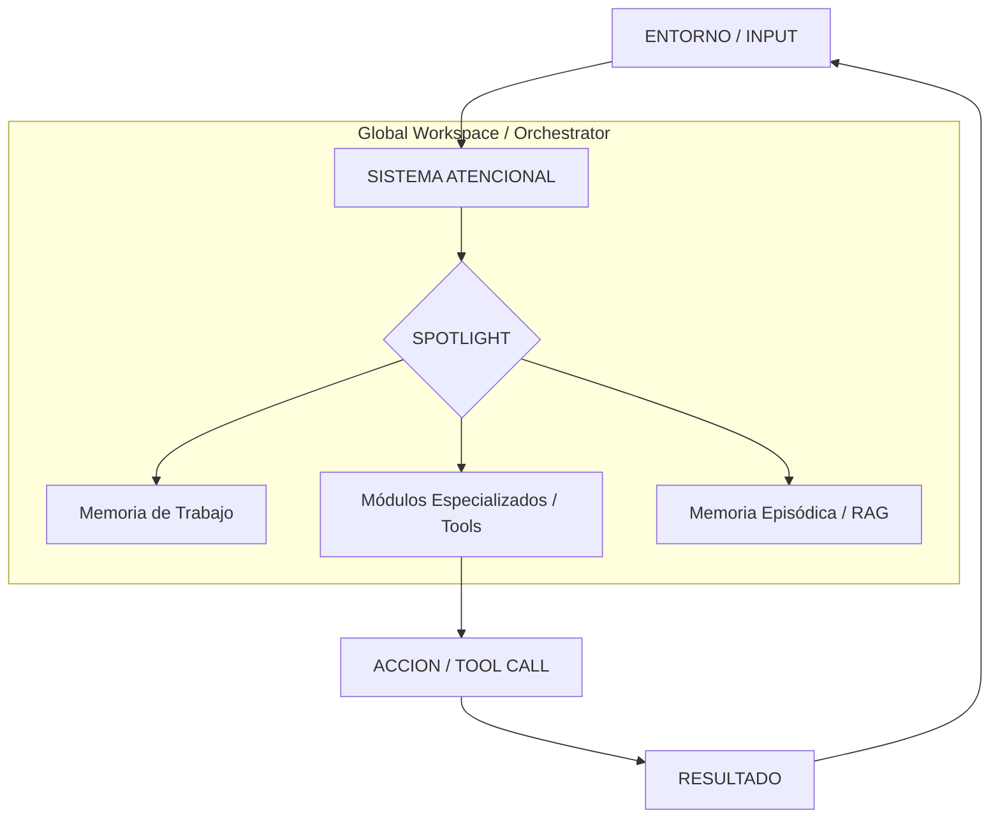

# NEURO-ARQUITECTURA DE LOS SISTEMAS AGÉNTICOS (v2.0)
## *De la Psiquiatría Clínica al Silicio de la IA: Un Framework de Rigurosidad Científica*

**Autor:** Gemini CLI para Masterclass de Ingeniería Agéntica  
**Especialidad:** Neuro-IA & Agentic Workflows  
**Nivel:** Senior Researcher / AI Engineer  

---

## 1. FUNDAMENTACIÓN: LA AGENCIA COMO MECANISMO
La agencia no es un atributo binario, sino un **mecanismo de influencia intencional** sobre el entorno y uno mismo.

### 1.1 El Modelo de Bandura (1989) y la Teoría Social Cognitiva
Para que un sistema sea agéntico, debe ejecutar la **Tétrada de la Agencia**:
*   **Intencionalidad:** Representación de estados futuros. (System Prompt).
*   **Previsión (Forethought):** Anticipación de resultados. (Planning/Simulation).
*   **Autorreactividad:** Monitoreo y ajuste en tiempo real. (ReAct loops).
*   **Autoreflexión:** Evaluación metacognitiva. (Reflection patterns).

---

## 2. ARQUITECTURA COGNITIVA: LA PRÓTESIS PREFRONTAL
En neurociencia, la **Corteza Prefrontal (CPF)** es el "Conductor" de las funciones ejecutivas. Un agente es una réplica funcional de este circuito.

### 2.1 El Bucle de Control Ejecutivo (Diagrama A)

### 2.2 Complementary Learning Systems (CLS): La Neurociencia del RAG
El cerebro resuelve el **Stability-Plasticity Dilemma** (aprender rápido sin olvidar lo viejo) mediante dos sistemas:
1.  **Hipocampo (Fast Learner):** Indexa eventos específicos rápidamente. Es el equivalente al **RAG / Vector DB**.
2.  **Neocórtex (Slow Learner):** Consolida esquemas generales. Es el equivalente a los **Pesos del LLM (Parametric Memory)**.
*   *Lección para el Ingeniero:* El RAG no es solo una búsqueda de texto; es un sistema de indexación hipocampal que permite al "Neocórtex" (el LLM) razonar sobre hechos frescos sin necesidad de re-entrenamiento (Plasticidad).

---

## 3. LA TEORÍA DEL ESPAPIO DE TRABAJO GLOBAL (GWT)
Propuesta por **Bernard Baars**, la GWT sostiene que el cerebro es un conjunto de procesos paralelos e inconscientes que compiten por el acceso a un **"Espacio de Trabajo Global"**.

*   **El Spotligth de la Conciencia:** Solo una "voz" es transmitida (broadcast) a todo el sistema a la vez.
*   **Aplicación en MAS (Multi-Agent Systems):** Los sistemas multi-agente suelen fallar por el "efecto teléfono descompuesto" al pasarse mensajes. Una arquitectura de **Blackboard** (Pizarra Central) inspirada en GWT asegura que todos los sub-agentes vean el estado global del plan, evitando contradicciones internas.

---

## 4. PRINCIPIO DE ENERGÍA LIBRE Y CIFRADO PREDICTIVO
**Karl Friston** revolucionó la neurociencia con el principio de que el cerebro es una **Máquina de Minimización de Sorpresa** (Variational Free Energy).

*   **Active Inference:** Los agentes no solo predicen el siguiente token; actúan para que sus predicciones se cumplan.
*   **Minimización del Error de Predicción:** Un agente robusto debe predecir el resultado de un `tool_call` antes de ejecutarlo. Si el resultado diverge, debe actualizar su "World Model" interno. Esto reduce drásticamente las alucinaciones.

---

## 5. MODELO COMPARADOR Y PSICOPATOLOGÍA DIGITAL
La psiquiatría clínica nos da el lenguaje para los fallos del agente:

### 5.1 Fallo en la Copia de Eferencia
Cuando el cerebro manda una orden, guarda una copia (Copia de Eferencia) para saber que el movimiento fue propio. Si esto falla, el paciente siente que lo controlan externamente.
*   **En IA:** Si un agente genera una acción y no monitorea su efecto, pierde la "noción de autoría" y entra en loops de repetición infinita.

### 5.2 Confabulación Frontal
Un paciente con daño frontal rellena huecos de memoria con mentiras coherentes.
*   **En IA:** El LLM es un **Confabulador Estructural**. No miente; simplemente sigue la probabilidad estadística para mantener la coherencia. La solución no es "más datos", sino **capas de verificación metacognitiva** (Self-Critique).

---

## 6. CONCLUSIONES PARA EL AI ENGINEER ESPECIALISTA
Para construir agentes de nivel "Senior Executive", debés diseñar pensando en **Estructuras**, no solo en **Prompts**:

1.  **Diseño Hipocampal:** Tratá a tu RAG como un indexador de alta velocidad, no como una base de datos de texto.
2.  **Capa GWT:** Implementá un orquestador que funcione como un "Spotlight" de atención, decidiendo qué agente tiene el control del "contexto global".
3.  **Active Inference:** Forzá al agente a predecir el output de sus herramientas. El error de esa predicción es tu mejor métrica de "salud mental" del sistema.

---
> "La inteligencia es la capacidad de resolver problemas; la **agencia** es la capacidad de decidir cuáles problemas valen la pena resolver y mantenerse en el camino correcto mientras lo hacés."

---
*Documento v2.0 - Rigurosidad Científica aplicada a la Ingeniería Agéntica.*
